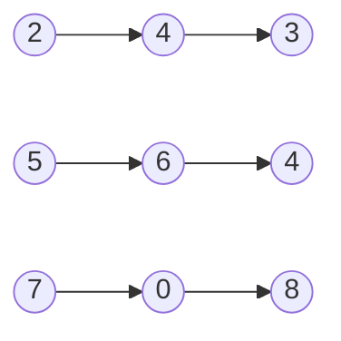

# [2. Add Two Numbers](https://leetcode.com/problems/add-two-numbers/)

You are given two **non-empty** linked lists representing two non-negative integers. The digits are stored in **reverse order**, and each of their nodes contains a single digit. Add the two numbers and return the sum as a linked list.

You may assume the two numbers do not contain any leading zero, except the number 0 itself.

<br>

**Example 1:**




- Input: `l1 = [2,4,3], l2 = [5,6,4]`  
- Output: `[7,0,8]`  
- Explanation: 342 + 465 = 807.


**Example 2:**

- Input: `l1 = [0], l2 = [0]`  
- Output: `[0]`


**Example 3:**

- Input: `l1 = [9,9,9,9,9,9,9], l2 = [9,9,9,9]`  
- Output: `[8,9,9,9,0,0,0,1]`
 

Constraints:

- The number of nodes in each linked list is in the range `[1, 100]`.
- `0 <= Node.val <= 9`
- It is guaranteed that the list represents a number that does not have leading zeros.


當然可以！這段程式碼的目的是將兩個由單向鏈表（singly-linked list）表示的數字相加。每個鏈表中的節點代表數字的一位，並且這些位數是逆序存儲的（即鏈表的第一個節點是最低有效位）。以下是程式碼的逐步解釋：

1. **定義鏈表節點的結構體**
   ```go
   type ListNode struct {
       Val  int
       Next *ListNode
   }
   ```
   這定義了一個 `ListNode` 結構體，它包含一個整數值 `Val` 和一個指向下一個節點的指標 `Next`。

2. **初始化**
   ```go
   func addTwoNumbers(l1 *ListNode, l2 *ListNode) *ListNode {
       dummy := &ListNode{}
       dummyHead := dummy
       carry := 0
   ```
   在這裡，我們創建了一個 `dummy` 節點，這是一個虛擬頭節點，用來簡化後續的鏈表操作。`dummyHead` 用來保存 `dummy` 節點的引用，以便最終返回結果鏈表的頭節點。`carry` 變數用來保存進位值。

3. **處理同時遍歷兩個鏈表的情況**
   ```go
   for l1 != nil && l2 != nil {
       sum := l1.Val + l2.Val + carry
       dummy.Next = &ListNode{Val: sum % 10}
       carry = sum / 10

       l1 = l1.Next
       l2 = l2.Next
       dummy = dummy.Next
   }
   ```
   在這段代碼中，我們遍歷兩個鏈表，將對應位置的數字和進位相加，創建一個新的節點並將其添加到結果鏈表中。`carry` 是除以10的結果，用來處理進位。

4. **確保 l1 是非空的鏈表**
   ```go
   if l1 == nil {
       l1, l2 = l2, l1
   }
   ```
   如果 `l1` 遍歷完了，但 `l2` 還有剩餘的節點，我們交換 `l1` 和 `l2`，這樣就可以重用下面的循環來處理剩下的節點。

5. **處理剩下的節點**
   ```go
   for l1 != nil {
       sum := l1.Val + carry
       dummy.Next = &ListNode{Val: sum % 10}
       carry = sum / 10

       l1 = l1.Next
       dummy = dummy.Next
   }
   ```
   當只有一個鏈表還有剩餘節點時，我們繼續處理這些節點，並將每個節點的值與進位相加，創建新的節點並添加到結果鏈表中。

6. **處理最後的進位**
   ```go
   if carry != 0 {
       dummy.Next = &ListNode{Val: carry}
   }
   ```
   如果最後還有進位，創建一個新的節點並將進位值設置為這個節點的值。

7. **返回結果鏈表**
   ```go
   return dummyHead.Next
   }
   ```
   最後返回結果鏈表的頭節點，即 `dummyHead.Next`。

這段程式碼完整地將兩個鏈表表示的數字相加，並生成一個新的鏈表來表示相加的結果。每個步驟都仔細處理了進位和不同鏈表長度的情況。


當 `l1` 和 `l2` 分別為 `[9,9,9,9,9,9,9]` 和 `[9,9,9,9]` 時，我們將模擬程式碼的整個運行流程。

### 初始鏈表
- `l1`：9 -> 9 -> 9 -> 9 -> 9 -> 9 -> 9
- `l2`：9 -> 9 -> 9 -> 9

### 初始化
- `dummy` 和 `dummyHead` 指向新建的虛擬頭節點 `ListNode{Val: 0, Next: nil}`
- `carry = 0`

### 第一個循環 (`while l1 != nil && l2 != nil`)

#### 第一步
- `sum = 9 (l1.Val) + 9 (l2.Val) + 0 (carry) = 18`
- `dummy.Next = ListNode{Val: 18 % 10 = 8}`
- `carry = 18 / 10 = 1`
- 移動到下一個節點：`l1` 和 `l2` 各移動一位，`dummy` 移動到 `dummy.Next`

#### 第二步
- `sum = 9 (l1.Val) + 9 (l2.Val) + 1 (carry) = 19`
- `dummy.Next = ListNode{Val: 19 % 10 = 9}`
- `carry = 19 / 10 = 1`
- 移動到下一個節點：`l1` 和 `l2` 各移動一位，`dummy` 移動到 `dummy.Next`

#### 第三步
- `sum = 9 (l1.Val) + 9 (l2.Val) + 1 (carry) = 19`
- `dummy.Next = ListNode{Val: 19 % 10 = 9}`
- `carry = 19 / 10 = 1`
- 移動到下一個節點：`l1` 和 `l2` 各移動一位，`dummy` 移動到 `dummy.Next`

#### 第四步
- `sum = 9 (l1.Val) + 9 (l2.Val) + 1 (carry) = 19`
- `dummy.Next = ListNode{Val: 19 % 10 = 9}`
- `carry = 19 / 10 = 1`
- 移動到下一個節點：`l1` 和 `l2` 各移動一位，`dummy` 移動到 `dummy.Next`

### 第二個循環 (`if l1 == nil`)

在這個例子中，`l2` 已經走完，`l1` 還剩下 `9 -> 9 -> 9 -> 9`。

### 第三個循環 (`while l1 != nil`)

#### 第一步
- `sum = 9 (l1.Val) + 1 (carry) = 10`
- `dummy.Next = ListNode{Val: 10 % 10 = 0}`
- `carry = 10 / 10 = 1`
- 移動到下一個節點：`l1` 移動一位，`dummy` 移動到 `dummy.Next`

#### 第二步
- `sum = 9 (l1.Val) + 1 (carry) = 10`
- `dummy.Next = ListNode{Val: 10 % 10 = 0}`
- `carry = 10 / 10 = 1`
- 移動到下一個節點：`l1` 移動一位，`dummy` 移動到 `dummy.Next`

#### 第三步
- `sum = 9 (l1.Val) + 1 (carry) = 10`
- `dummy.Next = ListNode{Val: 10 % 10 = 0}`
- `carry = 10 / 10 = 1`
- 移動到下一個節點：`l1` 移動一位，`dummy` 移動到 `dummy.Next`

#### 第四步
- `sum = 9 (l1.Val) + 1 (carry) = 10`
- `dummy.Next = ListNode{Val: 10 % 10 = 0}`
- `carry = 10 / 10 = 1`
- `l1` 移動到 `nil`，`dummy` 移動到 `dummy.Next`

### 處理最後的進位
- `carry` 為 1，所以添加一個新節點：`dummy.Next = ListNode{Val: 1}`

### 最終結果
結果鏈表為：
- `8 -> 9 -> 9 -> 9 -> 0 -> 0 -> 0 -> 1`

即 `[8, 9, 9, 9, 0, 0, 0, 1]`，表示 9999999 + 9999 = 10009998。

### Go 程式碼中的步驟：
```go
func addTwoNumbers(l1 *ListNode, l2 *ListNode) *ListNode {
    dummy := &ListNode{}
    dummyHead := dummy
    carry := 0

    for l1 != nil && l2 != nil {
        sum := l1.Val + l2.Val + carry
        dummy.Next = &ListNode{Val: sum % 10}
        carry = sum / 10

        l1 = l1.Next
        l2 = l2.Next
        dummy = dummy.Next
    }

    if l1 == nil {
        l1, l2 = l2, l1
    }

    for l1 != nil {
        sum := l1.Val + carry
        dummy.Next = &ListNode{Val: sum % 10}
        carry = sum / 10

        l1 = l1.Next
        dummy = dummy.Next
    }

    if carry != 0 {
        dummy.Next = &ListNode{Val: carry}
    }

    return dummyHead.Next
}
```

這段程式碼正確地將兩個鏈表表示的數字相加，並生成一個新的鏈表來表示相加的結果。
